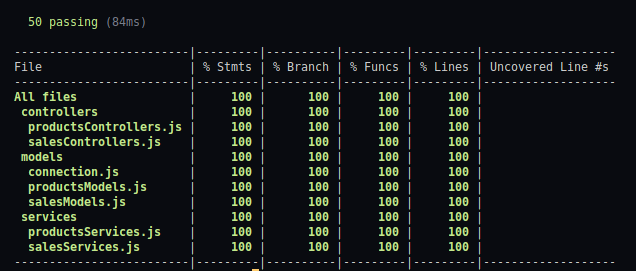

# Store Manager

<details> 
<summary>:brazil: Versão em Português</summary>

## Objetivo

Construir uma API para gerenciar o banco de dados de estoque e vendas de um comércio online que:

- usa uma interface uniforme e os métodos do protocolo de rede GET, POST, PUT e DELETE;
- é baseada em cliente-servidor;
- tem operações sem estado;
- faz uso de um sistema em três camadas distintas camadas seguindo o padrão Model-Service-Controller.

## Desafios
- Desenvolver uma api CRUD pela primeira vez;
- Construir a aplicação com uma arquitetura em camadas (Model, Service, Controller);
- Desenvolver testes que cobrissem 100% do código;

## Observações

Essa aplicação não usa recursos armazenáveis em cache, então ainda não é uma api do tipo RESTful. <br />
Ela foi desenvolvida utilizando o banco de dados MySQL e pacotes Node.js como express, express-rescue, mysql2, mocha, chai, chai-as-promised e sinon. <br />

## Executando a aplicação localmente

- Para instalar os containers docker:

```
docker-compose up -d
```

- Executar o terminal do container:

```
docker attach store_manager
```

- Instalar as dependências, criar e popular o banco de dados:

```
npm install && npm run migration && npm run seed
```

- Inicializar a aplicação:

```
npm start
```

- Executar os testes unitários:

```
npm run test:mocha
```

<br />

## Endpoints

### Produtos

| Método   | URL                                          |
| -------- | -------------------------------------------- |
| `GET`    | http://localhost:3000/products               |
| `GET`    | http://localhost:3000/products/:id           |
| `GET`    | http://localhost:3000/products/search?q=name |
| `PUT`    | http://localhost:3000/products/:id           |
| `POST`   | http://localhost:3000/products               |
| `DELETE` | http://localhost:3000/products/:id           |

### Vendas

| Método   | URL                             |
| -------- | ------------------------------- |
| `GET`    | http://localhost:3000/sales     |
| `GET`    | http://localhost:3000/sales/:id |
| `PUT`    | http://localhost:3000/sales/:id |
| `POST`   | http://localhost:3000/sales     |
| `DELETE` | http://localhost:3000/sales/:id |

<br />

## Cobertura de testes unitários



</details>

<details open> 
<summary>:us: English Version</summary>

## Objective

To build an API to manage the database of an online store's stock and sales that:

- uses an uniform interface and the methods of the network protocol GET, POST, PUT and DELETE;
- is client-server based;
- has stateless operations;
- makes use of three different layers following the Model-Service-Control standard .
  <br />

## Challenges
- Develop a CRUD api for the first time;
- Build an application with an architecture in layers (Model, Service, Controller);
- Develop tests covering 100% of the code;

## Observations

This application doesn't use cacheable resources, so it's not a RESTful app. <br />
It was developed using MySQL database and Node.js packages such as express, express-rescue, mysql2, mocha, chai, chai-as-promised and sinon. <br />

## Running the application locally

- To install the docker containers:

```
docker-compose up -d
```

- Run the container terminal:

```
docker attach store_manager
```

- Install dependencies, create and populate the database:

```
npm install && npm run migration && npm run seed
```

- Start the application:

```
npm start
```

- Run unit tests:

```
npm run test:mocha
```

<br />

## Endpoints

### Products

| Method   | URL                                          |
| -------- | -------------------------------------------- |
| `GET`    | http://localhost:3000/products               |
| `GET`    | http://localhost:3000/products/:id           |
| `GET`    | http://localhost:3000/products/search?q=name |
| `PUT`    | http://localhost:3000/products/:id           |
| `POST`   | http://localhost:3000/products               |
| `DELETE` | http://localhost:3000/products/:id           |

### Sales

| Method   | URL                             |
| -------- | ------------------------------- |
| `GET`    | http://localhost:3000/sales     |
| `GET`    | http://localhost:3000/sales/:id |
| `PUT`    | http://localhost:3000/sales/:id |
| `POST`   | http://localhost:3000/sales     |
| `DELETE` | http://localhost:3000/sales/:id |

<br />

## Unit tests coverage


</details>
